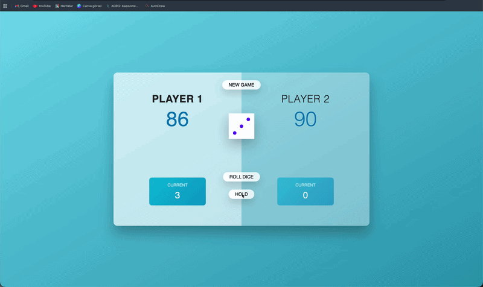
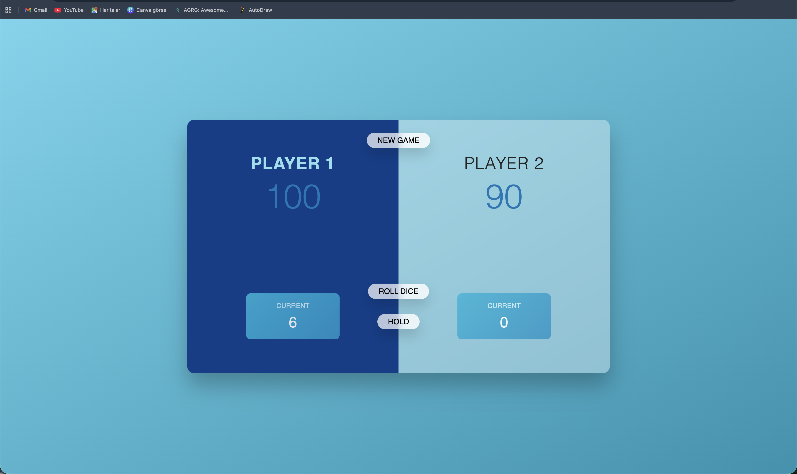
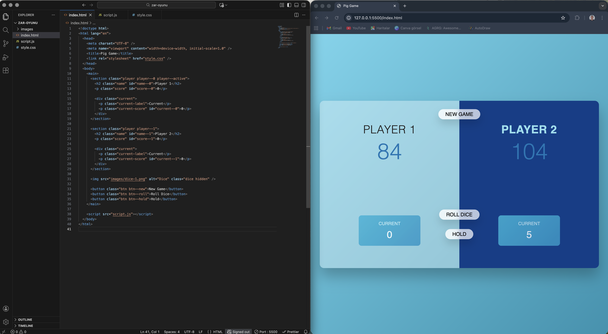

# 🎲 Dice Game Project

A fun and interactive **2-player dice game** built with JavaScript.  
The goal is simple: be the first player to reach **100 points** 🚀

This project focuses on **game logic, DOM manipulation, and user interaction**.

---

# 🎬 Demo Preview

Watch how the game flows, player turns switch, and scores update dynamically.

---

# 🧩 Interface Screens

### 🎮 Screen 1 – Game Start

Initial game layout with player panels, current score, and controls.

---

### ⚡ Screen 2 – Gameplay

Active gameplay with dice rolls, score updates, and player switching.

---

# 🎯 Game Rules

- 🎲 Roll the dice:
  - 2–6 → added to **current score**
  - 1 → lose current score, turn switches ❌  
- ✋ Hold:
  - Adds current score to **total score**
  - Switches turn 🔄  
- 🏆 First player to reach **100+ points wins**

---

# 🧠 JavaScript Focus

This project highlights:

- 🎯 Random number generation (dice roll)
- 🔁 Game state management
- 🧩 DOM manipulation
- ⚡ Event handling (roll / hold / switch player)
- 🎨 Dynamic UI updates

The goal was to build a **real interactive game logic** instead of a static UI.

---

# 🛠️ Technologies Used

- 🟧 HTML  
- 🎨 CSS  
- ⚡ JavaScript  

---

# ✨ Project Highlights

- Interactive 2-player gameplay  
- Real-time score updates  
- Clean and responsive UI  
- Clear game logic structure  
- Beginner-friendly but practical project  

---

# 🙏 Acknowledgment

Special thanks to **https://github.com/isveckrali** for guidance and structured learning approach.  

Also thanks to **https://github.com/Udemig** for providing a practical and career-focused learning environment.

---

# 📬 Contact

💼 LinkedIn  
https://www.linkedin.com/in/numan-balik-sverige  

🐙 GitHub  
https://github.com/numanbalik-web  

📧 Email  
numanbalik72@gmail.com  
